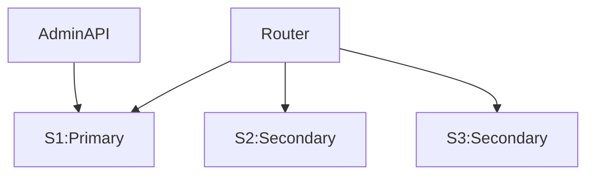

# MySQL 9.0.1 InnoDB Cluster with Docker Compose

## Installation

Install docker if you don't have docker on your linux machine

``` bash
curl -lfSh https://get.docker.com -o docker.sh
chmod +x docker.sh
sudo ./docker.sh
```

* Clone Project files
``` bash
git clone https://github.com/mahmoud-eskandari/mysql-cluster.git
```

* Change Directory to the project directory
``` bash
cd mysql-cluster
```
* Up databases
```
docker compose up -d s1 s2 s3
```

* initialize cluster (just before first use not more)
``` bash
docker compose exec -it s1 mysqlsh "root@s1:3306" --password="mysql" -f "/var/initialize.js" 

ON:
Please select a recovery method [C]lone/[I]ncremental recovery/[A]bort (default Clone):
Insert: C

```
* Up router
```
docker compose up -d router
```

view logs:
```
docker compose logs -f
```

# Log in to cluster
```
mysql root@localhost:6446 -p
Password: mysql
```

### Check Cluster Status:

``` bash
  docker compose exec -it s1 /bin/sh
  mysqlsh
  mysqlsh > \js
  mysqlsh > shell.connect('root@s1:3306', "mysql")
  mysqlsh > dba.getCluster().status();
  mysqlsh > \quit
```

* Change data directory for each server to another disks by editing `docker-compose.yml`

Like:
```
  s1:
    env_file:
      - server.env
    volumes:
      - ./data/s1:/var/lib/mysql
```
Change last line to:
```
    volumes:
      - ./mnt/disk1:/var/lib/mysql
```

Architucture:
